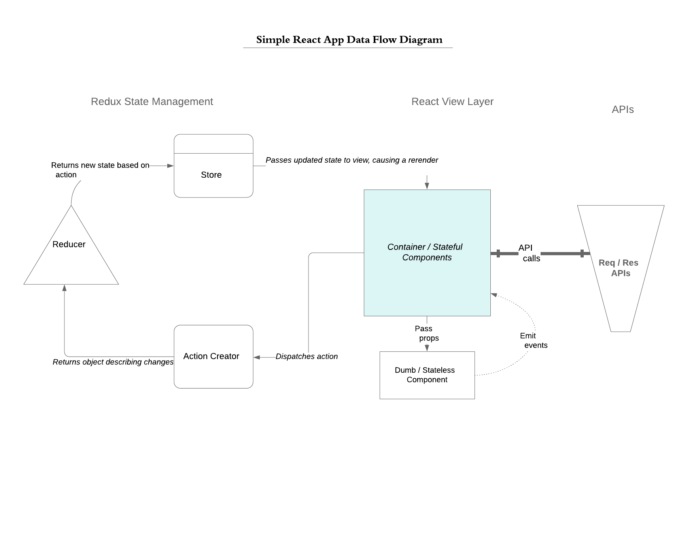

## Simple React App integration Req / Res API
 A simple React app that allows for creating, updating, and viewing a user record using the https://reqres.in/ API.

##Technology Stack
1. React - User interface development
2. HTML5 / CSS3 - Page markup and styling
3. JavaScript/ES6 - Core language
4. Redux - Predictable state management
5. Axios - Promise based HTTP client for the browser and node.js
6. React Table - a lightweight, fast and extendable datagrid built for React
7. This project was bootstrapped with [Create React App](https://github.com/facebook/create-react-app).

## How to run your code
## Setup project
1. Clone the repository
2. Change to the root of the project directory, and execute `npm install`. This process will take some time, so be patient!

### In the project directory, you can run:

 `npm start`

Runs the app in the development mode. 
Open [http://localhost:3000](http://localhost:3000) to view it in the browser.

The page will reload if you make edits. 
You will also see any lint errors in the console.

### `npm test`

Launches the test runner in the interactive watch mode. 
See the section about [running tests](https://facebook.github.io/create-react-app/docs/running-tests) for more information.

### `npm run build`

Builds the app for production to the `build` folder. 
It correctly bundles React in production mode and optimizes the build for the best performance.

The build is minified and the filenames include the hashes. 
Your app is ready to be deployed!

See the section about [deployment](https://facebook.github.io/create-react-app/docs/deployment) for more information.

## The app is configured to work with mock server (json-server) as alternative to Reqres API. 
To run using mock server, open a new terminal and execute 'npm run jsonserver'. Go to axiosClient.js in src/redux folder and change 'const JSON_BASE_URL = reqResAPI' to 'const JSON_BASE_URL = mockServer'. 

## Reasoning behind your technical choices.
1. React is a popular JavaScript library for building user interfaces. React makes it painless to create interative UIs and it's  component-based. Implemented React to build stateful and stateless components.
The components are encapsulated and they manage their state. Component can be compose to build complex UIs. For scenarios were components tree or hierarcy are very deep, the state of the application could become unpredictable and difficult to manage. Props are passed down from parent to child through intermediate children who don't need the data. Redux was introduced to solve these problems. According to Redux official website, "Redux is a predictable state container for JavaScript applications. It helps you write applications that behave consistently". Implemented Redux to pass data to components witout going through intermediate children. 
2. Used ESLint to discover code problems without executing it. Created linting rules and formatters for coding standards and best practices. 
3. Used Git hook with Husky - for every commit, the hooks will run eslint first, if there is/are no linting error(s), then commmit will pass else fail. Only properly linted code are pushed to the repository. 
4. Redux-Thunk - Basic Redux store allows only simple synchronous updates. Redux-Thunk middleware extends the store and was used to write async logic that interacts with the store.
5. Axios  - used Axios to make http requests. Prefeered Axios over native fetch() method because of it ability to perform automatic transforms of JSON data. Fetch() requires two-step process when handing JSON data.
6. React Table - used React Table to achieve lightweight, fast and extendable datagrid
7. Jest and Enzyme are popular unit testing tools for React application with smooth learning curve and great community support.

## Trade-offs you might have made, anything you left out, or what
##you might do differently if you were to spend additional time on the project.
1. Improve user experience and interface - design high fidelity mockup; apply more CSS styles; use Material-UI; CSS preprocessor like SSAS; cover all edge cases for form field validations; design for mobile first and responsive design; implement loading spinner for table, implement confirm message for add/edit user
2. Build more reusable components. Make userForm component resuable and configurable
4. Implement React Router for component navigation
5. Write more test cases, esp. for redux reducer and actions
6. Middleware library - use Redux-saga instead of Redux-thunk to write asynchronous code that looks synchronous
7. Reselect - use reselect, a memorized selector function for writing more concise logic
8. Lodash - use lodash for utility tasks like object manipulation 
9. Handle HTTP errors e.g. 500 - server error;  empty and invalid response, 
10. Reqres API: 'https://reqres.in/api/users/users'; // added /users here to avoid actual GET request
   Use mock server for better simulation of GET, POST and PUT requests 

## (Ideally) Link to to the hosted application
 Hosting URL: https://simplereactapp-8d5e2.firebaseapp.com

## (Optional) Link to other code you’re particularly proud of.
1. https://github.com/cyril-ui-developer/react_redux_readable_app
2. https://github.com/cyril-ui-developer/angular-space-launch-app

